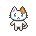
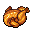

# Сценарий игры <!-- omit in toc -->

Игрок управляет котом , который двигается влево, вправо, вверхи или вниз.
Цель игры: собрать всю еду на уровне за определённое время, время игры ограничено. Игрок должен уклоняться от врагов, которые движутся по определённой траектории. За столкновение с врагом у игрока сгорает одна жизнь. Всего у игрока 3 жизни. Игрок побеждает, если он собрал всю еду на уровне и не истратил все жизни.
Пока в игре один уровень. В дальнейшем возможно будут добавлены ещё несколько.

В начале каждого уровня игрок появляется на карте уровня. Он должен собрать всю еду на уровне. За каждую найденную единицу еды игроку начисляются очки.

Существует несколько видов еды, например:

|               Еда               | Описание                                  |
|:-------------------------------:|:------------------------------------------|
|  | Пицца. За неё игрок получает 100 очков.   |
|   | Хотдог. За него игрок получает 200 очков. |
|     | Пицца. За неё игрок получает 300 очков.   |

_TODO:_

- [ ] Добавить другие уровни в виде комнат дома.
- [ ] Найти другие изображения еды.
- [ ] Добавить несколько вариантов внешнего вида кота.

_Хотелки:_

- [ ] Реализовать после сбора всей еды на уровне появление дополнительной еды, которая даёт больше очков.
